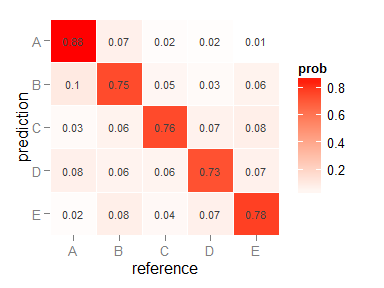
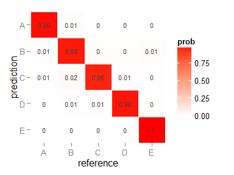
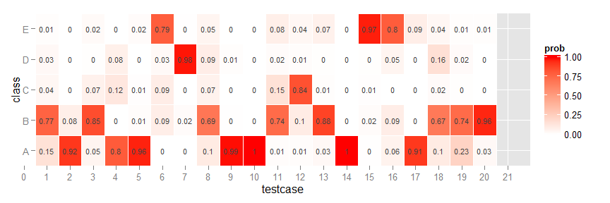

# Practical Machine Learning Project
Sven Boekhoven  
Saturday, January 24, 2015  

### Background

Using devices such as Jawbone Up, Nike FuelBand, and Fitbit it is now possible to collect a large amount of data about personal activity relatively inexpensively. These type of devices are part of the quantified self movement - a group of enthusiasts who take measurements about themselves regularly to improve their health, to find patterns in their behavior, or because they are tech geeks. One thing that people regularly do is quantify how much of a particular activity they do, but they rarely quantify how well they do it. In this project, your goal will be to use data from accelerometers on the belt, forearm, arm, and dumbell of 6 participants. They were asked to perform barbell lifts correctly and incorrectly in 5 different ways. More information is available from the website here: http://groupware.les.inf.puc-rio.br/har (see the section on the Weight Lifting Exercise Dataset).

### Data

The training data for this project are available here: [https://d396qusza40orc.cloudfront.net/predmachlearn/pml-training.csv]

The test data are available here: [https://d396qusza40orc.cloudfront.net/predmachlearn/pml-testing.csv]

### Citation

The data for this project come from this source: [http://groupware.les.inf.puc-rio.br/har]. 

### Goal

The goal is to find a model that can predicht the classes below based on the sensor data of an activity.

- exactly according to the specification (Class A)
- throwing the elbows to the front (Class B)
- lifting the dumbbell only halfway (Class C)
- lowering the dumbbell only halfway (Class D)
- throwing the hips to the front (Class E)

## Loading data

Below the code for loading the data (which was already downloaded to my harddrive).


```r
library("dplyr")
library("caret")
library("tidyr")

set.seed(54356)

pml.training <- read.csv("pml-training.csv", na.strings = c("NA","#DIV/0!", ""), dec = ".")
```

## Cleaning data

The data needs to be cleaned before it can be used for modelling. I tried several different ways of cleanng the data  before I came up with the following steps:

1. Remove new_window == yes observations because these seem to be aggragates of other column.
2. Remove the first columns (id, timestamps, subject name) because they are not usefull in predicting.
3. Remove all columns with NA values.


```r
x <- pml.training %>% filter(new_window == "no")
x <- x[8:length(x)]
x <- x[ , ! apply(x ,2 ,function(x) any(is.na(x)) ) ]
```

## Creating training and testset for cross validation

The assignment provides a training and testset, however, the testset is not really a testset, but more a submission set. To be able to validate the model the provided trainingset will be split in a training and testset for the modelling.


```r
inTrain <- createDataPartition(y=x$classe,
                               p=0.6, list=FALSE)
trainingset <- subset(x[inTrain,])
testset <- subset(x[-inTrain,])
```

## Cross validation

The default resampling scheme for the caret train function is bootstrap. I have used custom settings instead by setting the below `trainControl`.

The out of sample error should be higher than the in sample error because the the model is based on the training set and will therefor most likely have a slightly worst performance on the testset. This will be shown further in the project.

## Selecting variables

First I made a model on a small part of the training set (for speed). Then I selected the 20 most important variables with `varImp` and run the model again. I repeated this, meanwhile balancing the accurancy and number of variables. With 10 variables I still got very good accuracy and speed on the model with the full training set.

# Decision Tree Model


```r
Ctrl <- trainControl(method = "repeatedcv", repeats = 3)
model_rpart <- train(classe ~ roll_belt + pitch_forearm + yaw_belt + roll_forearm + magnet_dumbbell_z + 
                             pitch_belt + magnet_dumbbell_y + magnet_dumbbell_x + accel_belt_z + 
                             magnet_belt_z, data=trainingset, method="rpart", tuneLength = 30, trControl = Ctrl)
model_rpart$finalModel
```

```
## n= 11532 
## 
## node), split, n, loss, yval, (yprob)
##       * denotes terminal node
## 
##     1) root 11532 8249 A (0.28 0.19 0.17 0.16 0.18)  
##       2) roll_belt< 130.5 10561 7284 A (0.31 0.21 0.19 0.18 0.11)  
##         4) pitch_forearm< -33.95 937    5 A (0.99 0.0053 0 0 0) *
##         5) pitch_forearm>=-33.95 9624 7279 A (0.24 0.23 0.21 0.2 0.12)  
##          10) magnet_dumbbell_y< 436.5 8067 5776 A (0.28 0.18 0.24 0.19 0.1)  
##            20) roll_forearm< 121.5 4996 2948 A (0.41 0.18 0.19 0.17 0.059)  
##              40) magnet_dumbbell_z< -27.5 1649  524 A (0.68 0.2 0.013 0.069 0.034)  
##                80) roll_forearm>=-136.5 1345  254 A (0.81 0.16 0.013 0.013 0.0059)  
##                 160) roll_forearm< 116.5 1250  179 A (0.86 0.12 0.014 0.0072 0.0064) *
##                 161) roll_forearm>=116.5 95   28 B (0.21 0.71 0 0.084 0) *
##                81) roll_forearm< -136.5 304  181 B (0.11 0.4 0.0099 0.32 0.16)  
##                 162) pitch_belt>=26.05 68   15 B (0.22 0.78 0 0 0) *
##                 163) pitch_belt< 26.05 236  140 D (0.081 0.3 0.013 0.41 0.2)  
##                   326) magnet_dumbbell_x< -532 76   32 B (0 0.58 0 0 0.42)  
##                     652) yaw_belt< -92.65 44    0 B (0 1 0 0 0) *
##                     653) yaw_belt>=-92.65 32    0 E (0 0 0 0 1) *
##                   327) magnet_dumbbell_x>=-532 160   64 D (0.12 0.16 0.019 0.6 0.1) *
##              41) magnet_dumbbell_z>=-27.5 3347 2424 A (0.28 0.17 0.27 0.21 0.071)  
##                82) yaw_belt>=169.5 406   47 A (0.88 0.057 0 0.057 0.0025) *
##                83) yaw_belt< 169.5 2941 2026 C (0.19 0.18 0.31 0.23 0.08)  
##                 166) pitch_belt< -43.15 284   47 B (0.025 0.83 0.074 0.039 0.028) *
##                 167) pitch_belt>=-43.15 2657 1763 C (0.21 0.11 0.34 0.26 0.086)  
##                   334) accel_belt_z< -158.5 1035  449 C (0.19 0.041 0.57 0.18 0.019)  
##                     668) roll_belt>=128.5 161   20 A (0.88 0 0 0 0.12) *
##                     669) roll_belt< 128.5 874  288 C (0.064 0.048 0.67 0.22 0)  
##                      1338) yaw_belt< 163.5 614   91 C (0.068 0.021 0.85 0.059 0) *
##                      1339) yaw_belt>=163.5 260  106 D (0.054 0.11 0.24 0.59 0)  
##                        2678) magnet_belt_z< -311.5 62   22 C (0.16 0.13 0.65 0.065 0) *
##                        2679) magnet_belt_z>=-311.5 198   48 D (0.02 0.11 0.12 0.76 0) *
##                   335) accel_belt_z>=-158.5 1622 1133 D (0.22 0.16 0.19 0.3 0.13)  
##                     670) pitch_forearm< -0.035 157   40 A (0.75 0.15 0.032 0 0.07) *
##                     671) pitch_forearm>=-0.035 1465  976 D (0.17 0.16 0.21 0.33 0.13)  
##                      1342) pitch_belt>=1.3 962  740 C (0.14 0.23 0.23 0.22 0.18)  
##                        2684) yaw_belt>=-93.15 828  609 B (0.16 0.26 0.26 0.11 0.21)  
##                          5368) magnet_dumbbell_y>=154.5 715  502 B (0.18 0.3 0.18 0.11 0.23)  
##                           10736) yaw_belt< -88.15 404  200 B (0.16 0.5 0.11 0.022 0.2) *
##                           10737) yaw_belt>=-88.15 311  225 E (0.21 0.029 0.26 0.23 0.28)  
##                             21474) magnet_dumbbell_z< 331.5 214  134 C (0.3 0.042 0.37 0.2 0.089)  
##                               42948) magnet_dumbbell_x>=-420.5 49    0 A (1 0 0 0 0) *
##                               42949) magnet_dumbbell_x< -420.5 165   85 C (0.091 0.055 0.48 0.25 0.12)  
##                                 85898) pitch_forearm< 22.8 92   18 C (0.076 0.065 0.8 0.011 0.043) *
##                                 85899) pitch_forearm>=22.8 73   32 D (0.11 0.041 0.082 0.56 0.21) *
##                             21475) magnet_dumbbell_z>=331.5 97   30 E (0 0 0 0.31 0.69) *
##                          5369) magnet_dumbbell_y< 154.5 113   22 C (0 0.053 0.81 0.088 0.053) *
##                        2685) yaw_belt< -93.15 134   18 D (0.052 0.015 0.037 0.87 0.03) *
##                      1343) pitch_belt< 1.3 503  221 D (0.21 0.024 0.16 0.56 0.044)  
##                        2686) pitch_belt< -42.05 140   74 A (0.47 0.043 0.36 0.13 0) *
##                        2687) pitch_belt>=-42.05 363   99 D (0.11 0.017 0.085 0.73 0.061) *
##            21) roll_forearm>=121.5 3071 2058 C (0.079 0.18 0.33 0.23 0.18)  
##              42) magnet_dumbbell_y< 291.5 1832  953 C (0.092 0.13 0.48 0.16 0.13)  
##                84) magnet_dumbbell_z>=285 272  141 A (0.48 0.14 0.048 0.099 0.24)  
##                 168) roll_forearm< 174.5 145   27 A (0.81 0.12 0 0.048 0.021) *
##                 169) roll_forearm>=174.5 127   66 E (0.1 0.16 0.1 0.16 0.48) *
##                85) magnet_dumbbell_z< 285 1560  694 C (0.024 0.13 0.56 0.17 0.12)  
##                 170) pitch_belt>=26.15 110   18 B (0.1 0.84 0.0091 0 0.055) *
##                 171) pitch_belt< 26.15 1450  585 C (0.019 0.081 0.6 0.18 0.12)  
##                   342) pitch_forearm< 37.15 1093  340 C (0.0073 0.074 0.69 0.1 0.13)  
##                     684) pitch_belt>=0.725 1028  275 C (0.0078 0.079 0.73 0.079 0.1) *
##                     685) pitch_belt< 0.725 65   28 E (0 0 0 0.43 0.57) *
##                   343) pitch_forearm>=37.15 357  202 D (0.053 0.1 0.31 0.43 0.098)  
##                     686) magnet_dumbbell_z>=-47 135   42 C (0 0.037 0.69 0.16 0.12) *
##                     687) magnet_dumbbell_z< -47 222   88 D (0.086 0.14 0.086 0.6 0.086) *
##              43) magnet_dumbbell_y>=291.5 1239  809 D (0.06 0.24 0.11 0.35 0.25)  
##                86) pitch_forearm< 23.65 766  514 B (0.051 0.33 0.15 0.15 0.32)  
##                 172) magnet_dumbbell_x>=-92.5 112    3 B (0.0089 0.97 0 0.018 0) *
##                 173) magnet_dumbbell_x< -92.5 654  409 E (0.058 0.22 0.17 0.17 0.37)  
##                   346) roll_forearm< 132.5 109   35 C (0 0.28 0.68 0 0.037)  
##                     692) pitch_forearm< -26 28    0 B (0 1 0 0 0) *
##                     693) pitch_forearm>=-26 81    7 C (0 0.037 0.91 0 0.049) *
##                   347) roll_forearm>=132.5 545  304 E (0.07 0.21 0.073 0.21 0.44)  
##                     694) roll_belt>=-8.29 516  275 E (0.074 0.22 0.078 0.16 0.47) *
##                     695) roll_belt< -8.29 29    0 D (0 0 0 1 0) *
##                87) pitch_forearm>=23.65 473  159 D (0.074 0.091 0.042 0.66 0.13)  
##                 174) magnet_belt_z>=-327 440  126 D (0.077 0.095 0.045 0.71 0.068) *
##                 175) magnet_belt_z< -327 33    2 E (0.03 0.03 0 0 0.94) *
##          11) magnet_dumbbell_y>=436.5 1557  765 B (0.035 0.51 0.04 0.22 0.2)  
##            22) roll_belt>=-0.575 1371  579 B (0.039 0.58 0.046 0.25 0.088)  
##              44) yaw_belt< -2.825 816  162 B (0.066 0.8 0.039 0.017 0.076)  
##                88) magnet_belt_z>=-358 764  113 B (0.069 0.85 0.042 0.018 0.018) *
##                89) magnet_belt_z< -358 52    4 E (0.019 0.058 0 0 0.92) *
##              45) yaw_belt>=-2.825 555  227 D (0 0.25 0.056 0.59 0.1)  
##                90) pitch_belt< 15.2 220   82 B (0 0.63 0.14 0 0.23)  
##                 180) pitch_belt< -43.05 146   15 B (0 0.9 0.096 0 0.0068) *
##                 181) pitch_belt>=-43.05 74   24 E (0 0.095 0.23 0 0.68) *
##                91) pitch_belt>=15.2 335    7 D (0 0 0 0.98 0.021) *
##            23) roll_belt< -0.575 186    0 E (0 0 0 0 1) *
##       3) roll_belt>=130.5 971    6 E (0.0062 0 0 0 0.99) *
```

# Random forest model 


```r
Ctrl <- trainControl(method = "oob")
model_rf <- train(classe ~ roll_belt + pitch_forearm + yaw_belt + roll_forearm + magnet_dumbbell_z + 
                             pitch_belt + magnet_dumbbell_y + magnet_dumbbell_x + accel_belt_z + 
                             magnet_belt_z, data=trainingset, method="rf", 
                  trControl = Ctrl, tuneGrid = data.frame(.mtry = 2))
model_rf
```

```
## Random Forest 
## 
## 11532 samples
##    52 predictor
##     5 classes: 'A', 'B', 'C', 'D', 'E' 
## 
## No pre-processing
## Resampling results
## 
##   Accuracy   Kappa    
##   0.9829171  0.9783928
## 
## Tuning parameter 'mtry' was held constant at a value of 2
## 
```

# Confusion matrix for both models

The plots below show that the random forest model yields a better result.

## Descision tree


```r
predictions_rparttest <- predict(model_rpart, testset)
confusionMatrix(predictions_rparttest, testset$classe)[3]
```

```
## $overall
##            Accuracy               Kappa       AccuracyLower 
## 0.78865174388339410 0.73304034012689634 0.77934958488684636 
##       AccuracyUpper        AccuracyNull      AccuracyPValue 
## 0.79773444379843106 0.28474752732951586 0.00000000000000000 
##       McnemarPValue 
## 0.00000000004701279
```

```r
conf_rpart <- as.data.frame(confusionMatrix(predictions_rparttest, testset$classe)[2])
conf_rpart <- conf_rpart %>% rename(prediction = table.Prediction, reference = table.Reference, count = table.Freq) %>% 
        arrange(desc(prediction)) %>% group_by(prediction) %>% mutate(prob = count/sum(count)) %>% ungroup
ggplot(conf_rpart, aes(reference, prediction)) + 
        geom_tile(aes(fill = prob), colour = "white") + 
        geom_text(aes(fill = prob, label = round(prob, 2)), size=3, colour="grey25") +
        scale_fill_gradient(low = "white", high = "red") +
        scale_x_discrete(expand = c(0, 0)) +
        scale_y_discrete(expand = c(0, 0), limits = c("E","D","C","B","A")) 
```

 

## Random forest


```r
predictions_rftest <- predict(model_rf, testset)
confusionMatrix(predictions_rftest, testset$classe)[3]
```

```
## $overall
##       Accuracy          Kappa  AccuracyLower  AccuracyUpper   AccuracyNull 
##      0.9829516      0.9784353      0.9798019      0.9857268      0.2847475 
## AccuracyPValue  McnemarPValue 
##      0.0000000            NaN
```

```r
conf_rf <- as.data.frame(confusionMatrix(predictions_rftest, testset$classe)[2])
conf_rf <- conf_rf %>% rename(prediction = table.Prediction, reference = table.Reference, count = table.Freq) %>% 
        arrange(desc(prediction)) %>% group_by(prediction) %>% mutate(prob = count/sum(count)) %>% ungroup
ggplot(conf_rf, aes(reference, prediction)) + 
        geom_tile(aes(fill = prob), colour = "white") + 
        geom_text(aes(fill = prob, label = round(prob, 2)), size=3, colour="grey25") +
        scale_fill_gradient(low = "white", high = "red") +
        scale_x_discrete(expand = c(0, 0)) +
        scale_y_discrete(expand = c(0, 0), limits = c("E","D","C","B","A")) 
```

 

## Sample Error of random forest


```r
model_rf$finalModel ## in-sample
```

```
## 
## Call:
##  randomForest(x = x, y = y, mtry = param$mtry) 
##                Type of random forest: classification
##                      Number of trees: 500
## No. of variables tried at each split: 2
## 
##         OOB estimate of  error rate: 1.69%
## Confusion matrix:
##      A    B    C    D    E class.error
## A 3254   17    9    2    1 0.008833384
## B   23 2153   43   11    1 0.034961900
## C    0   18 1980   14    0 0.015904573
## D    1    4   26 1857    1 0.016940180
## E    1   12    6    5 2093 0.011336797
```

```r
confusionMatrix(predictions_rftest, testset$classe)[3] ## out-of-sample
```

```
## $overall
##       Accuracy          Kappa  AccuracyLower  AccuracyUpper   AccuracyNull 
##      0.9829516      0.9784353      0.9798019      0.9857268      0.2847475 
## AccuracyPValue  McnemarPValue 
##      0.0000000            NaN
```

The in sample error of the random forest model is 1.69%. The out of sample error is 1.71% (1 - out of sample accuracy). The error rate for the out-of-sample is slightly higher what was expected. Because the model is very accurate the difference is very small.

# Prediction using Random forest model

As shown above the random forest model was the best to predict. So this model is used to predict the class for the submission.   

The heatmap shows that the prediction has a high probability for serveral observation, but is also less certain for others. We will see what the result is when the anwsers are submitted.


```r
bestfit <- model_rf

pml.submission <- read.csv("pml-testing.csv", na.strings = c("NA","#DIV/0!", ""), dec = ".")

predprob <- predict(bestfit, pml.submission, type = "prob")
predprob$testcase <- 1:nrow(predprob)
predprob <- gather(predprob, "class", "prob", 1:5)
ggplot(predprob, aes(testcase, class)) + 
        geom_tile(aes(fill = prob), colour = "white") + 
        geom_text(aes(fill = prob, label = round(prob, 2)), size=3, colour="grey25") +
        scale_fill_gradient(low = "white", high = "red") +
        scale_x_discrete(expand = c(0, 0)) +
        scale_y_discrete(expand = c(0, 0)) 
```

 

```r
final_predictions <- predict(bestfit, pml.submission)
final_predictions
```

```
##  [1] B A B A A E D B A A B C B A E E A B B B
## Levels: A B C D E
```

Below the submission files are generated


```r
pml_write_files = function(x){
        n = length(x)
        for(i in 1:n){
                filename = paste0("problem_id_",i,".txt")
                write.table(x[i],file=filename,quote=FALSE,row.names=FALSE,col.names=FALSE)
        }
}

pml_write_files(final_predictions)
```
